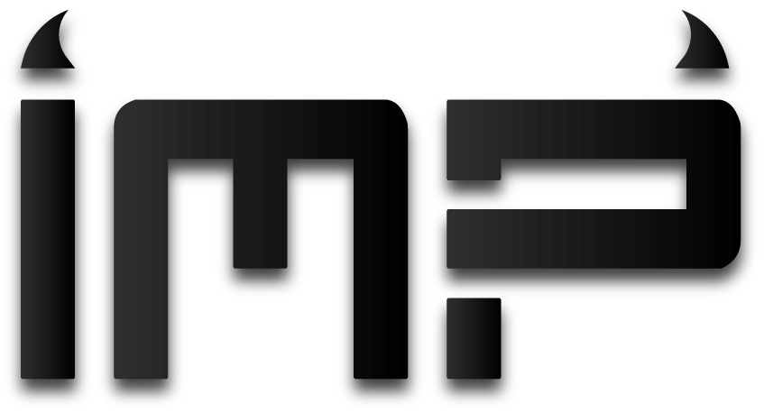

  
  

---------------------------------------

IMP converts Eve Online channel chat into audio visual queues, letting you observe the state of Eve star systems and receive alerts in a more efficient manner.  

* IMP automatically detects your pilots and moves the map as they change star systems.
* IMP's map is themeable and rotatable.
  * Colors, shapes, fonts, etc. can be changed.
  * New configurations can be saved as personal themes.
* All alerts are customizable.
  * New files can be added to imp/audio and will appear as options in the GUI.
  * Imp can be configured to suppress redundant alerts and/or alerts created by your own pilots.
* New rules can be created to fire user defined actions.
  * Rules can be configured to act upon any open channel, not just intel channels.
  * Rules use regular-expressions in every field for extreme flexibility.
  * Rules can play their own user-definable sounds or launch external apps.

  
  

  
  

The latest binary releases are available on [the releases page](https://github.com/3vi1/IMP/releases).

Linux installation packages are in progress.  Until then, you can download the source and build by following the instructions in the INSTALL.md file.

--Khasm Kaotiqa
